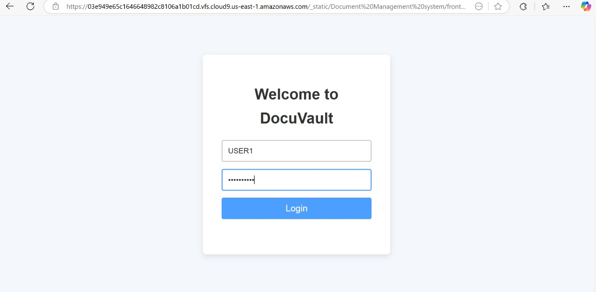
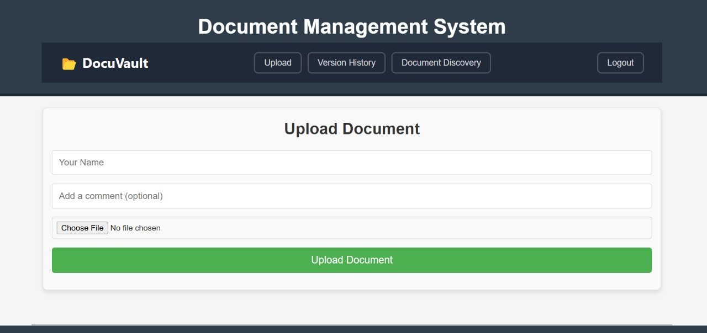
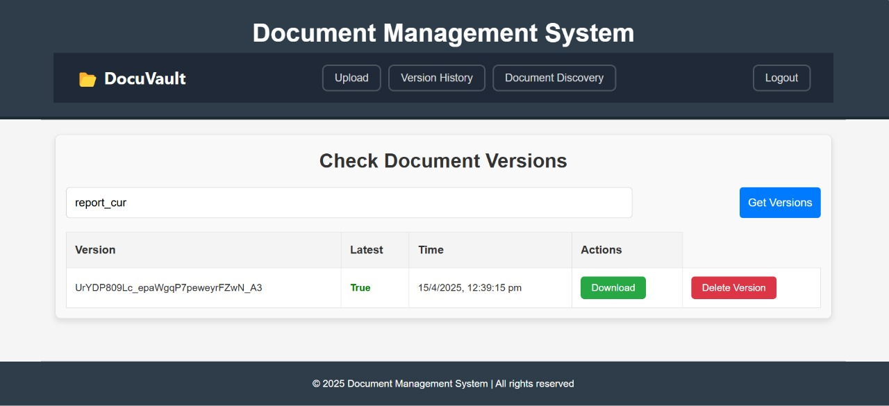
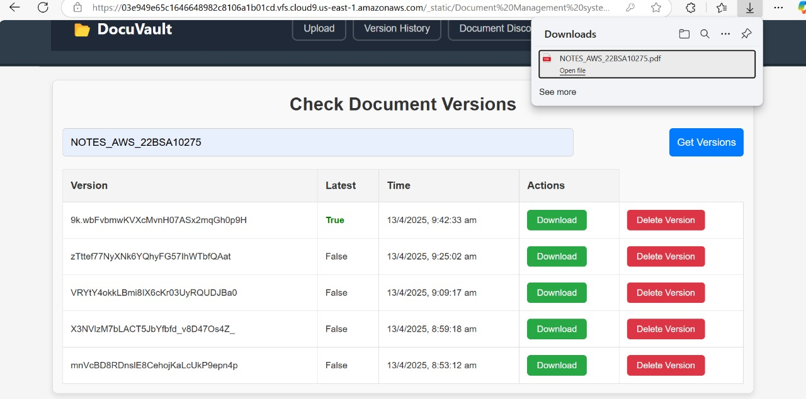
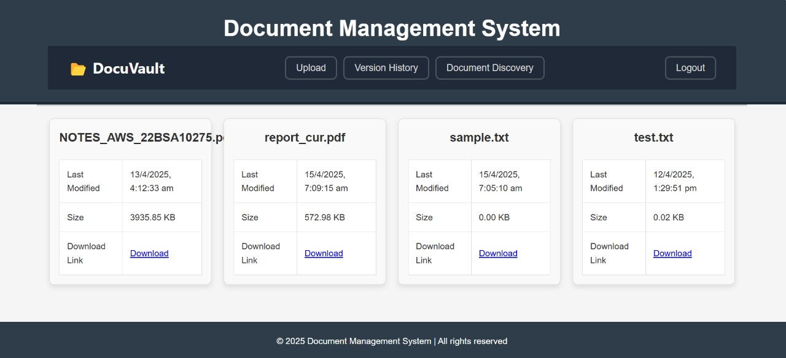

# 🗄️ DocuVault – Secure Document Management with Version Control

**DocuVault** is an enterprise-grade, secure, and user-friendly document management system designed to provide a single source of truth for all organizational documents. Built with modern cloud technologies and full version control, DocuVault ensures data integrity, regulatory compliance, and seamless collaboration.

---

## 🌟 Key Features

- 🔐 **Secure Upload & Retrieval** — Upload, manage, and access documents with access control.
- 🕓 **Version Control** — Automatically track changes, maintain history, and revert with ease.
- 👥 **Collaboration Tools** — Commenting, check-in/check-out, and change tracking.
- 🔎 **Smart Discovery** — Full-text search across all stored documents.
- 📦 **Batch Processing** — Efficient bulk uploads and downloads.
- 🧾 **Audit Logging** — Every user action is tracked with detailed logs.

---

## 🏗️ Architecture Overview

**Frontend:** React  
**Backend:** Flask  
**Cloud Platform:** AWS  
**Database:** Amazon RDS (PostgreSQL)  
**Storage:** Amazon S3 with versioning  
**Security:** AWS IAM, AWS KMS  
**Monitoring:** Amazon CloudWatch  

---

## 🖼️ Screenshots

| Login Screen               | Document Upload             |
|---------------------------|-----------------------------|
|  |  |

| Version History            | Document Download           |
|---------------------------|-----------------------------|
|  |  |

| Full-Text Discovery        |
|---------------------------|
|  |

---

## 🚀 How It Works

### ✅ Upload
Users can securely upload documents via a clean web interface. Files are stored in **Amazon S3**, with automatic versioning and metadata indexed in **Amazon RDS**.

### 🔄 Version Control
DocuVault leverages S3's built-in versioning and backend tracking to allow version rollback, comparison, and auditing.

### 🔐 Security
- Documents encrypted with **AES-256** via **AWS KMS**.
- Access managed using **AWS IAM** roles and policies.
- Activity logged and monitored with **Amazon CloudWatch**.

---

## 🛠️ AWS Services Used

| Service          | Purpose                                      |
|------------------|----------------------------------------------|
| Amazon EC2       | Hosts the Flask backend and React frontend   |
| Amazon S3        | Document storage with versioning             |
| Amazon RDS       | Metadata and user data                       |
| Amazon EBS       | Persistent storage for EC2                   |
| AWS IAM          | Secure access control                        |
| AWS KMS          | Document encryption                          |
| Amazon CloudWatch| Monitoring, metrics, and alerting            |

---

## ⚙️ Setup Instructions

### 1. Clone the Repository

```bash
git clone https://github.com/your-org/DocuVault.git
cd DocuVault
